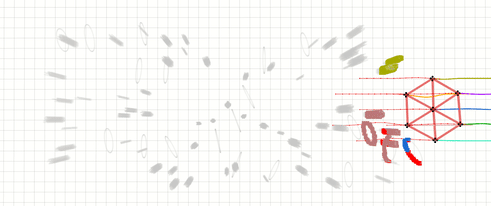
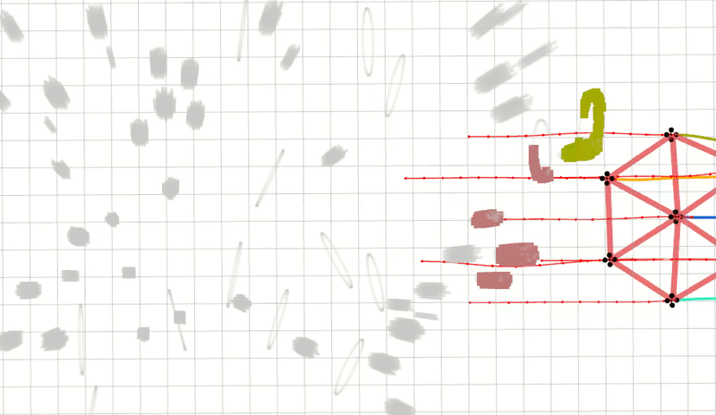
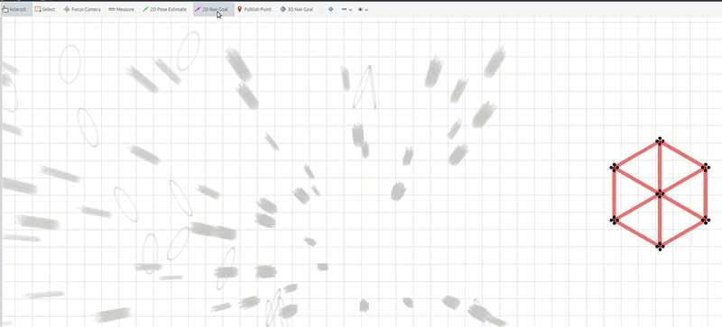
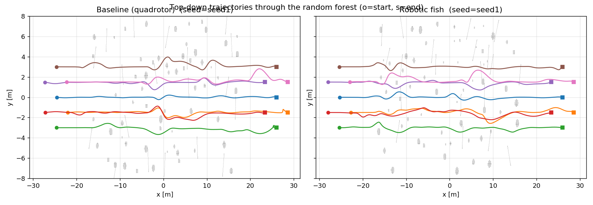
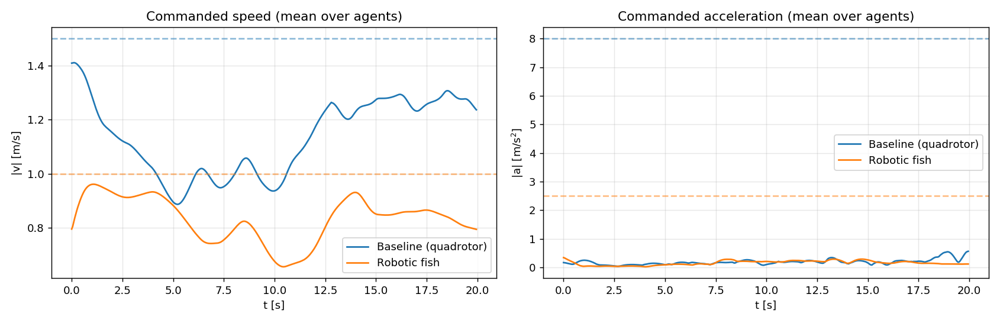
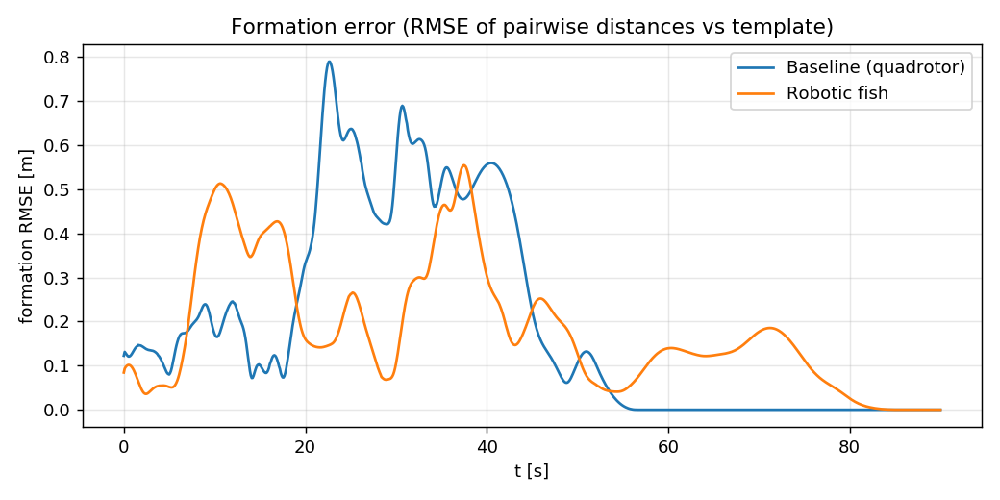
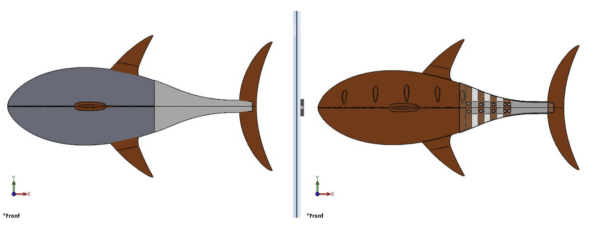
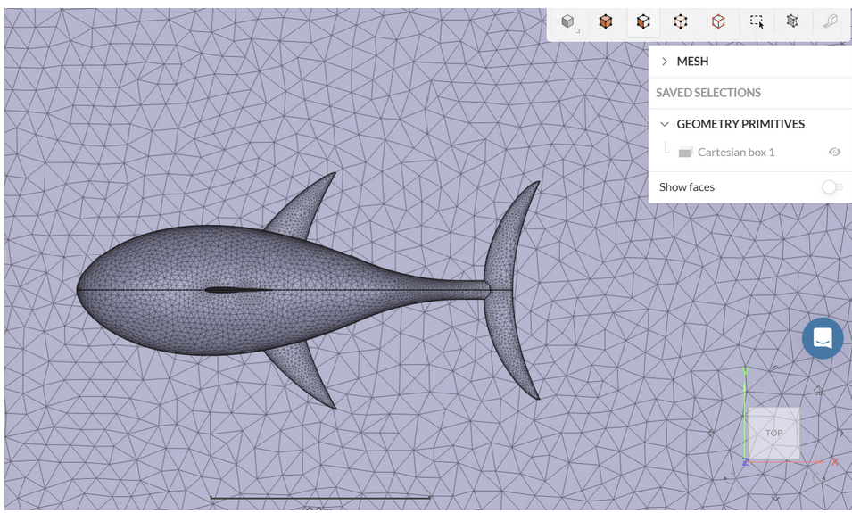
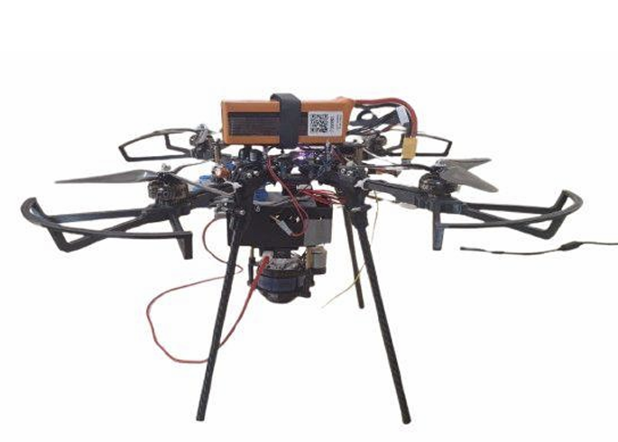

# A Unified Hybrid Aerial–Aquatic Swarm Architecture

### Integrating Biomimetic Locomotion, Hierarchical Path Planning, and an Adaptive Cross-Domain Communication Protocol

**Authors:** I. Harihara Sudar, Harsh Soni, Chinmay K, Rishi Charan,
Laxmi Narayana Charan, and Mervin Joe Thomas
*(Robotics Lab, Dept. of Mechanical Engineering, National Institute of
Technology Karnataka — NITK, Surathkal, India)*
Corresponding author: Mervin Joe Thomas (`mervinthomas@nitk.edu.in`)

This repository is the complete, reproducible companion to the journal paper —
the manuscript, the swarm-formation simulation, the physical-robot CAD, and the
demo videos, all in one place.

<p align="center">
  <br/>
  <em>Baseline quadrotor swarm (left) vs. the robotic-fish swarm (right) executing the same formation-flight task.</em>
</p>

---

## Table of contents

- [Abstract](#abstract)
- [Key contributions](#key-contributions)
- [Demo videos](#demo-videos)
- [Simulation results](#simulation-results)
- [Hardware & CAD](#hardware--cad)
- [Repository map](#repository-map)
- [Reproducing the simulation study](#reproducing-the-simulation-study)
- [How to cite](#how-to-cite)
- [Licensing & attribution](#licensing--attribution)

---

## Abstract

Single-medium robots are fundamentally constrained: aerial drones offer rapid
mobility and wide situational awareness but cannot sense beneath the surface,
while aquatic robots offer endurance, stealth, and precise underwater
maneuvering but suffer from slow, latency-bound communication and difficult
surface transitions. This work presents a **unified hybrid aerial–aquatic swarm
architecture** that couples a school of biomimetic robotic fish with a team of
autonomous quadrotors into a single, cooperative, cross-domain system. The
architecture is organized into five layers — physical modeling, hardware and
actuation, control and coordination, hybrid communication, and
simulation/visualization — and is validated in ROS2/Gazebo with RViz
visualization and on hardware prototypes, establishing a reproducible foundation
for persistent, multi-domain swarm missions in environmental monitoring, search
and rescue, and coastal surveillance.

---

## Key contributions

| # | Contribution | Headline result |
| --- | --- | --- |
| 1 | **Biomimetic locomotion** — undulatory propulsion grounded in Lighthill's elongated-body theory, validated by an ALE moving-mesh CFD study, realized in hardware via an ESP32-driven central pattern generator (CPG) with PID closure. | **+10 %** Froude propulsive efficiency for two fish in antiphase at 0.4 L spacing. |
| 2 | **Hierarchical path planning** — global Particle Swarm Optimization (PSO) + local Model Predictive Control (MPC), feeding the CPG for the fish and a cascaded ArduPilot/optical-flow stack for the GNSS-denied drone, with frustum-guided precision docking and magnetic auto-charging. | Contracting the dynamic envelope to fish-like values **≈ halves RMS jerk** at **100 %** success (see [results](#simulation-results)). |
| 3 | **The ADAPTH protocol** — *Adaptive Dynamic Aerial–Aquatic Path-Tracking and Hybridization*: a relay-based "wait-and-verify" scheme bridging low-latency RF and high-latency acoustic links. | **85 %** end-to-end communication success in noisy conditions. |

---

## Demo videos

All clips also live in [`media/videos/`](media/videos/) (stored as GIF so they
render inline here and in the paper). Conversion-to-MP4 commands for YouTube are
in [`media/videos/README.md`](media/videos/README.md).

### 1 — Seven-agent hexagon school holding formation
<p align="center"></p>

### 2 — Navigating the random-forest obstacle field
<p align="center"></p>

### 3 — Interactive "2D Nav Goal" target selection in RViz
<p align="center"></p>

### 4 — Baseline quadrotor vs. robotic fish (side-by-side playback, seed 1)
<p align="center"></p>

---

## Simulation results

A controlled comparison between the upstream quadrotor swarm (**baseline**) and
the robotic-fish variant on an identical formation-flight task: same planner
(EGO-Swarm formation planner), same environment, **7 agents**, **5 obstacle
seeds**. The *only* difference is the dynamic-feasibility envelope:

| Varied (the only difference) | Baseline | Fish |
| --- | --- | --- |
| `max_vel` | 1.5 m/s | 1.0 m/s |
| `max_acc` | 8.0 m/s² | 2.5 m/s² |

### Full metrics (mean ± std across 5 seeds)

| Metric | Unit | Baseline (quadrotor) | Robotic fish |
|---|---|---|---|
| Max speed | m/s | 1.581 ± 0.014 | 1.126 ± 0.047 |
| Mean speed | m/s | 0.976 ± 0.030 | 0.726 ± 0.068 |
| Max accel | m/s² | 1.355 ± 0.249 | 0.854 ± 0.383 |
| Mean accel | m/s² | 0.218 ± 0.025 | 0.123 ± 0.031 |
| **RMS jerk** | m/s³ | 0.658 ± 0.116 | **0.338 ± 0.129** |
| Path length | m | 51.420 ± 0.224 | 52.325 ± 0.372 |
| Traversal time | s | 44.919 ± 1.433 | 64.501 ± 4.327 |
| Formation RMSE (mean) | m | 0.176 ± 0.023 | 0.217 ± 0.026 |
| Formation RMSE (max) | m | 0.774 ± 0.078 | 0.799 ± 0.208 |
| Min inter-agent dist | m | 1.599 ± 0.354 | 1.705 ± 0.453 |
| Mean obstacle clearance | m | 1.116 ± 0.068 | 1.094 ± 0.077 |
| Near-miss fraction (< 0.3 m) | – | 0.058 ± 0.014 | 0.066 ± 0.013 |
| **Success rate** | % | 100 | 100 |

**Takeaway:** the fish envelope **roughly halves RMS jerk** (0.66 → 0.34 m/s³)
and cuts mean acceleration ≈ 44 % — visibly smoother, lower-effort motion — at
the cost of ≈ 44 % longer traversal, while formation accuracy, obstacle
clearance, and safety stay *within noise* of the baseline. Full method and
per-seed data: [`simulation/EXPERIMENTS.md`](simulation/EXPERIMENTS.md).

### Figures

<p align="center">
  <br/>
  <em>Aggregate metric comparison (mean ± std across 5 seeds).</em>
</p>

| Executed trajectories | Commanded kinematics |
| :---: | :---: |
|  |  |
| Top-down paths through the forest (seed 1); ○ = start, □ = end. | Speed & acceleration (mean over agents), first 20 s, with limits dashed. |

| Formation error over time | RViz: formation mid-field |
| :---: | :---: |
|  |  |
| RMSE of pairwise distances vs. the hexagon template. | The 7-agent hexagon school weaving through the obstacle forest. |

<p align="center">
  <br/>
  <em>All seven executed trajectories spanning the field, start hexagon (left) to goal (right).</em>
</p>

---

## Hardware & CAD

The physical platform's mechanical design is in
[`hardware/cad/`](hardware/cad/), exactly as exported from OSF:

| Folder | Files | Use |
| --- | --- | --- |
| `SOLIDWORKS FILES/` | 37 `.SLDPRT` parts + 2 `.SLDASM` assemblies | Native editable source (SolidWorks). |
| `FABRICATION FILES/` | 15 `.STL` + 9 `.DXF` | 3D-printing meshes and 2D laser/water-jet cut profiles. |
| `PARASOLID FILES/` | 2 `.x_t` | Neutral CAD exchange format (open in any CAD package). |

| Robotic-fish CAD | Fish mesh (sim) | Aerial platform |
| :---: | :---: | :---: |
|  |  |  |

> **Viewing without SolidWorks:** open the `.STL` files in any free mesh viewer
> (MeshLab, the system 3D viewer, or an online STL viewer), or import
> `PARASOLID FILES/*.x_t` into FreeCAD / Fusion / Onshape.

---

## Repository map

| Path | Contents |
| --- | --- |
| [`papers/unified/`](papers/unified/) | The journal manuscript (`main.tex`, `main.pdf`, figures, `refs.bib`). |
| [`papers/ascend/`](papers/ascend/) | Companion ASCEND aerial-platform paper (`main.tex`, `main.pdf`, figures). |
| [`simulation/`](simulation/) | Robotic-fish swarm-formation simulation (ROS/EGO-Swarm re-skin) + the baseline-vs-fish experiment. Start at [`simulation/PROJECT_GUIDE.md`](simulation/PROJECT_GUIDE.md). |
| [`simulation/paper/`](simulation/paper/) | Focused write-up of just the simulation study ("Dynamic-Envelope Re-Tuning of a Graph-Theoretic Swarm") — distinct from the unified manuscript. |
| [`hardware/cad/`](hardware/cad/) | Physical-robot CAD (SolidWorks / STL / DXF / Parasolid). |
| [`media/videos/`](media/videos/) | Demo clips (GIF) for YouTube and the journal supplement. |

---

## Reproducing the simulation study

Everything runs in the `robotic-fish:latest` Docker image (fish mesh + skin +
a pre-built `ego_planner` workspace). From `simulation/`:

```bash
# Build the image
make            # or: docker build -t robotic-fish:latest .

# Headless experiment: collect data, then analyse
docker run -d --name fish_exp --network host \
  -v "$PWD/experiment":/exp -v "$PWD/experiment/results":/out robotic-fish:latest sleep infinity
docker exec -e REC_SECONDS=90 -e SEEDS="1 2 3 4 5" fish_exp bash /exp/run_all.sh   # collect
docker exec fish_exp python3 /exp/analyze.py                                        # tables + figures
docker exec fish_exp python3 /exp/make_video.py                                     # playback GIF
```

Conversion details and the live-RViz demo commands are in
[`simulation/PROJECT_GUIDE.md`](simulation/PROJECT_GUIDE.md),
[`simulation/ROBOTIC_FISH.md`](simulation/ROBOTIC_FISH.md), and
[`simulation/EXPERIMENTS.md`](simulation/EXPERIMENTS.md).

---

## How to cite

```bibtex
@article{sudar2026unified,
  title   = {A Unified Hybrid Aerial--Aquatic Swarm Architecture Integrating
             Biomimetic Locomotion, Hierarchical Path Planning, and an Adaptive
             Cross-Domain Communication Protocol},
  author  = {Sudar, I. Harihara and Soni, Harsh and K, Chinmay and
             Charan, Rishi and Charan, Laxmi Narayana and Thomas, Mervin Joe},
  year    = {2026}
}
```

---

## Licensing & attribution

The simulation under `simulation/` is derived from
[ZJU-FAST-Lab/Swarm-Formation](https://github.com/ZJU-FAST-Lab/Swarm-Formation)
and is distributed under the **GPLv3** license (see `simulation/LICENSE` and the
top-level [`LICENSE`](LICENSE)). The paper text, figures, and CAD models are the
work of the authors above; please cite the paper before reuse.
