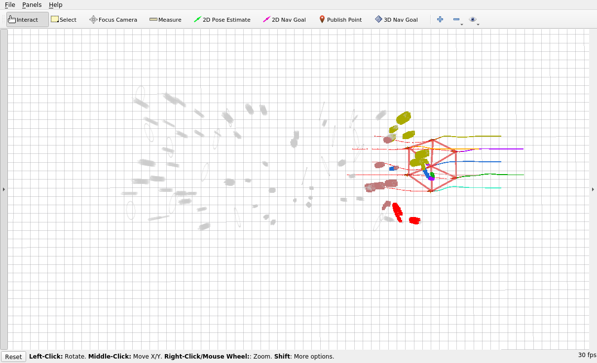
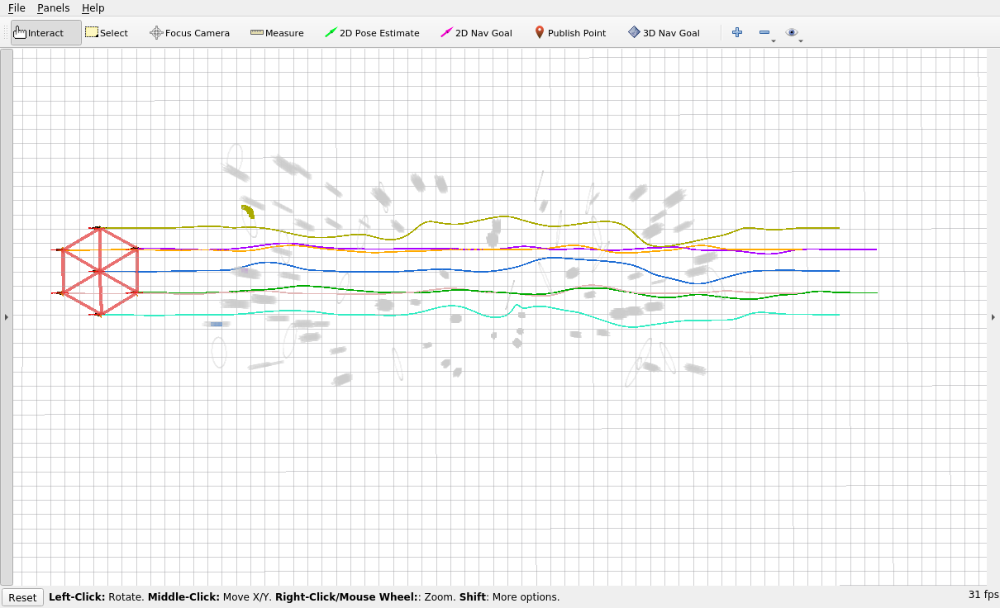
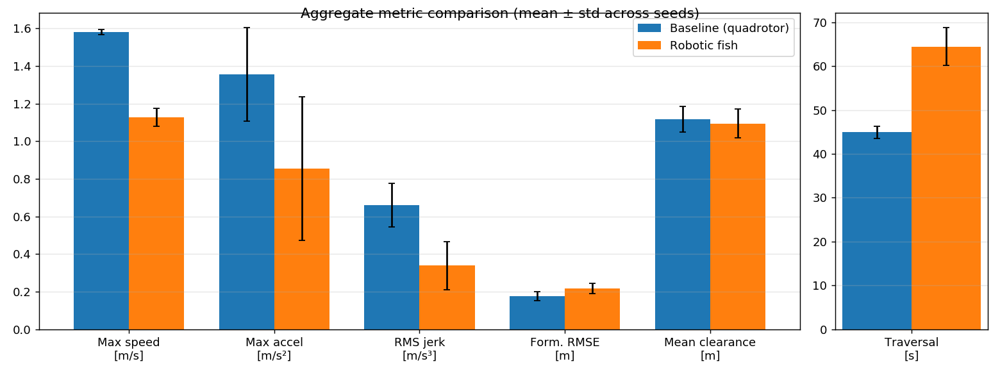

# Robotic-Fish Swarm — Project Guide

A robotic-fish re-skin of the [ZJU-FAST-Lab **Swarm-Formation**](https://github.com/ZJU-FAST-Lab/Swarm-Formation)
distributed formation planner, plus a controlled experiment quantifying how the
fish dynamics change the swarm's behaviour versus the original quadrotor.

This guide is the entry point. For details see:

| Document | What it covers |
| --- | --- |
| **[ROBOTIC_FISH.md](ROBOTIC_FISH.md)** | The conversion: fish mesh/skin, the changed dynamic-feasibility envelope, and the scope/fidelity of the re-skin. |
| **[EXPERIMENTS.md](EXPERIMENTS.md)** | The baseline-vs-fish study: setup, reproduction commands, full metrics table, findings, and caveats. |
| **[README.md](README.md)** | Upstream Swarm-Formation README (build, dependencies, original demos). |

## What this project is

The upstream framework flies a swarm of 7 quadrotors in a rigid formation
through a cluttered environment using a distributed spatial-temporal trajectory
optimizer (EGO-Swarm formation planner). This variant:

1. **Re-skins** each agent as a robotic fish (custom mesh + fish-orange colour).
2. **Re-tunes the motion envelope** to fish-like values — slower cruise, gentle
   drag-limited acceleration (`max_vel 1.5→1.0 m/s`, `max_acc 8.0→2.5 m/s²`).
3. **Measures the consequences** with a headless experiment harness that records
   both conditions across 5 obstacle seeds and computes kinematic, formation,
   and safety metrics.

## Visual result

Side-by-side playback of the recorded runs (seed 1). Both swarms start together;
the slower fish school falls behind but holds formation and reaches the goal:


RViz captures of the fish swarm traversing the random forest:

| Formation mid-field | Full executed paths |
| --- | --- |
|  |  |

## Headline results

Same planner, same environment, 7 agents, 5 obstacle seeds — only the dynamic
envelope differs. Full table and per-seed data in **[EXPERIMENTS.md](EXPERIMENTS.md)**.

| Metric | Baseline (quadrotor) | Robotic fish |
| --- | --- | --- |
| Max speed (m/s) | 1.581 ± 0.014 | 1.126 ± 0.047 |
| RMS jerk (m/s³) | 0.658 ± 0.116 | **0.338 ± 0.129** |
| Traversal time (s) | 44.9 ± 1.4 | 64.5 ± 4.3 |
| Formation RMSE, mean (m) | 0.176 ± 0.023 | 0.217 ± 0.026 |
| Mean obstacle clearance (m) | 1.116 ± 0.068 | 1.094 ± 0.077 |
| Success rate | 100 % | 100 % |

**Takeaway:** the fish envelope roughly **halves RMS jerk** and cuts mean
acceleration ~44 % (much smoother, lower-effort motion) at the cost of **~44 %
longer traversal**, while formation accuracy, clearance, and safety stay within
noise of the baseline.



## Quick start

Everything runs in the `robotic-fish:latest` Docker image (fish mesh + skin +
a pre-built `ego_planner` workspace at `/workspace`).

```bash
# Build the image (see Dockerfile / Makefile)
make            # or: docker build -t robotic-fish:latest .

# --- Live RViz demo (needs an X display; see swarm-fish-rviz notes) ---
docker run -d --name fish_rviz --network host \
  --env DISPLAY=:0 --env LIBGL_ALWAYS_SOFTWARE=1 robotic-fish:latest sleep infinity
docker exec -d fish_rviz bash -lc 'source /opt/ros/noetic/setup.bash; source /workspace/devel/setup.bash; \
  roscore & sleep 5; roslaunch ego_planner rviz.launch & sleep 6; roslaunch ego_planner normal_hexagon.launch'

# --- Headless experiment (data + analysis + figures) ---
docker run -d --name fish_exp --network host \
  -v "$PWD/experiment":/exp -v "$PWD/experiment/results":/out robotic-fish:latest sleep infinity
docker exec -e REC_SECONDS=90 -e SEEDS="1 2 3 4 5" fish_exp bash /exp/run_all.sh   # collect
docker exec fish_exp python3 /exp/analyze.py                                        # tables + figures
docker exec fish_exp python3 /exp/make_video.py                                     # playback GIF
```

## Repository map

```
ROBOTIC_FISH.md          conversion writeup
EXPERIMENTS.md           experiment writeup + full results table
PROJECT_GUIDE.md         this file
experiment/
  run_all.sh             headless sweep driver (baseline + fish × seeds)
  record_exp.py          per-run odom/cmd/obstacle recorder
  analyze.py             metrics, summary tables, fig_*.png
  make_video.py          animated trajectory playback (GIF)
  xwd2png.py             stdlib X11 screenshot → PNG converter
  results/
    summary_table.md/csv aggregate metrics (mean ± std)
    metrics_per_run.csv  per-seed metrics
    fig_*.png            trajectories, kinematics, formation, bars
    figs_rviz/           RViz captures + swarm_playback.gif
    <cond>/seed<k>/      raw recorded CSVs
src/                     upstream planner + fish mesh/skin changes
```

## Notes

- The fish conversion is a **re-skin + envelope re-tune**; the underlying control
  is still the quadrotor (so3) model with reduced limits, not true hydrodynamic
  swim dynamics. See the scope note in [ROBOTIC_FISH.md](ROBOTIC_FISH.md).
- The recording window must outlast the slowest condition (the fish need ~64 s);
  90 s is used. An earlier 60 s sweep that cut the fish off is excluded from the
  repo (`.gitignore`).
